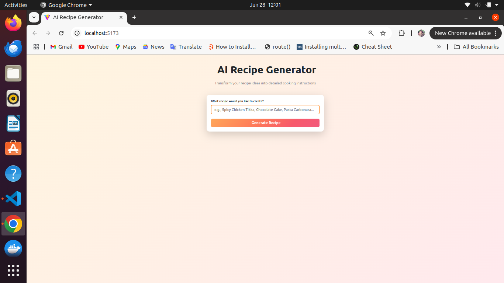

# 🧠🍽️ AI Recipe Generator

An intelligent recipe generator that uses AI to generate complete recipes based on a **user-provided recipe name**. The AI model predicts the **difficulty level**, **spice level**, **meal type**, **ingredients**, and detailed **instructions** — all presented through a clean and intuitive user interface.

---

## 🛠️ Tech Stack

### Frontend

- ReactJS
- Axios
- Bootstrap

### Backend

- Django
- Django REST Framework
- Google Gemini API
- Django CORS Headers

---

## 🔗 API Endpoints

### 📥 Recipe Input & Output

- `POST /api/recipe/` – Generate more information such as ingredients, instructions, meal type and so on using recipe name.

---

## 🔧 Setup Instructions

### Backend (Django)

```bash
cd backend
python -m venv env
source env/bin/activate
pip install -r requirements.txt
python manage.py migrate
python manage.py runserver

### Recipe Simple Form



### AI Generate Recipe Info


